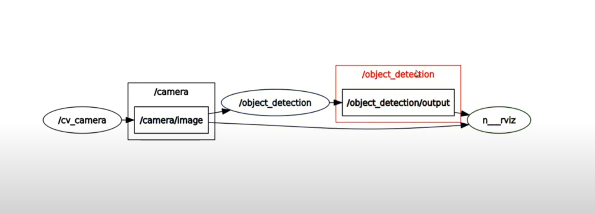

<!-- Badges -->
  

## 🚀 ROS Object Detection Package

Welcome to **ROS_Obj_Detection**! This repository contains two ROS2 Python packages for real-time camera streaming and object detection. Whether you're a robotics enthusiast or a developer building vision-based robotic applications, this tutorial-style README will help you get started quickly.

---

## 📦 Repository Structure

```bash
ROS_Obj_Detection/
├── src/
│   ├── camera_py/       # Publishes camera frames as sensor_msgs/Image
│   └── Objet_detection/ # Subscribes to camera feed, runs object detection, publishes annotated Image
└── .github/             # CI workflows, badges, etc.
```


### 🔍 camera_py
- **Node:** `camera_py.camera:main`
- **Topic Out:** `/camera/image` (`sensor_msgs/Image`)
- **Topic Out:** `/camera/status` (`std_msgs/Bool`)
- Streams webcam at ~15 FPS, publishes image and status flag.

### 🔍 Objet_detection
- **Node:** `Objet_detection.detection_node:main`
- **Topic In:** `/camera/image`
- **Topic Out:** `/object_detection/output`
- Detects common objects using `cvlib`, draws bounding boxes, logs inference time.

---

## ⚙️ Prerequisites

- **ROS2 (Humble)** installed and sourced
- **Python 3.9+**
- **OpenCV** and **cv_bridge**
- **cvlib** (for detection)
- A webcam or video source


## 🛠️ Installation

1. Clone the repo:
   ```bash
   git clone https://github.com/Badredenyx/ROS_Obj_Detection.git
   cd ROS_Obj_Detection
   ```

2. Install dependencies:
   ```bash
   # Create and activate virtual environment (optional)
   python3 -m venv venv && source venv/bin/activate

   # Install Python requirements
   pip install -U setuptools pytest cvlib opencv-python
   ```

3. Build the workspace:
   ```bash
   source /opt/ros/humble/setup.bash
   colcon build --symlink-install
   source install/setup.bash
   ```

---

## 🎬 Usage

1. **Launch the camera node**
   ```bash
   ros2 run camera_py camera
   ```

2. **In a new terminal, launch the detector**
   ```bash
   ros2 run Objet_detection detector
   ```

3. **View with `rqt_image_view`**
   ```bash
   ros2 run rqt_image_view rqt_image_view /object_detection/output
   ```

4. **Optional:** record a demo GIF
   ```bash
   # Using ffmpeg
   ffmpeg -f x11grab -i :0.0 -t 10 demo.mp4
   ffmpeg -i demo.mp4 -vf "fps=10,scale=320:-1:flags=lanczos" demo.gif
   ```


---

## ⚙️ Configuration

The camera node and detector require no additional parameters by default. To customize:

| Parameter                 | Default      | Description                           |
| ------------------------- | ------------ | ------------------------------------- |
| `camera_py/camera_rate`   | `15.0`       | Frame publish rate (Hz)               |
| `Objet_detection/gpu`     | `false`      | Enable GPU acceleration (cvlib flag)  |

To override, use ROS2 remapping or launch files with `<param>` tags.

---

## 🗺️ Architecture Diagram



(Replace with your own diagram in `docs/`)

---

## 🧪 Testing

Run style and unit tests:

```bash
colcon test --packages-select camera_py Objet_detection
colcon test-result --verbose
```

---

## 🤝 Contributing

Contributions are welcome! Please:

1. Fork the repo
2. Create a feature branch (`git checkout -b feature/my-feature`)
3. Commit your changes (`git commit -m 'Add new feature'`)
4. Push to branch (`git push origin feature/my-feature`)
5. Open a Pull Request

Please follow the code style (PEP8, PEP257) and include tests for new functionality.

---

## 📜 License

This project is licensed under the MIT License. See [LICENSE](LICENSE) for details.

---

## 📖 References & Resources

- [ROS2 Documentation](https://docs.ros.org/) 
- [cvlib on PyPI](https://pypi.org/project/cvlib/)
- [cv_bridge package](https://github.com/ros-perception/vision_opencv/tree/ros2/cv_bridge)

---

*Happy coding!* ✨
